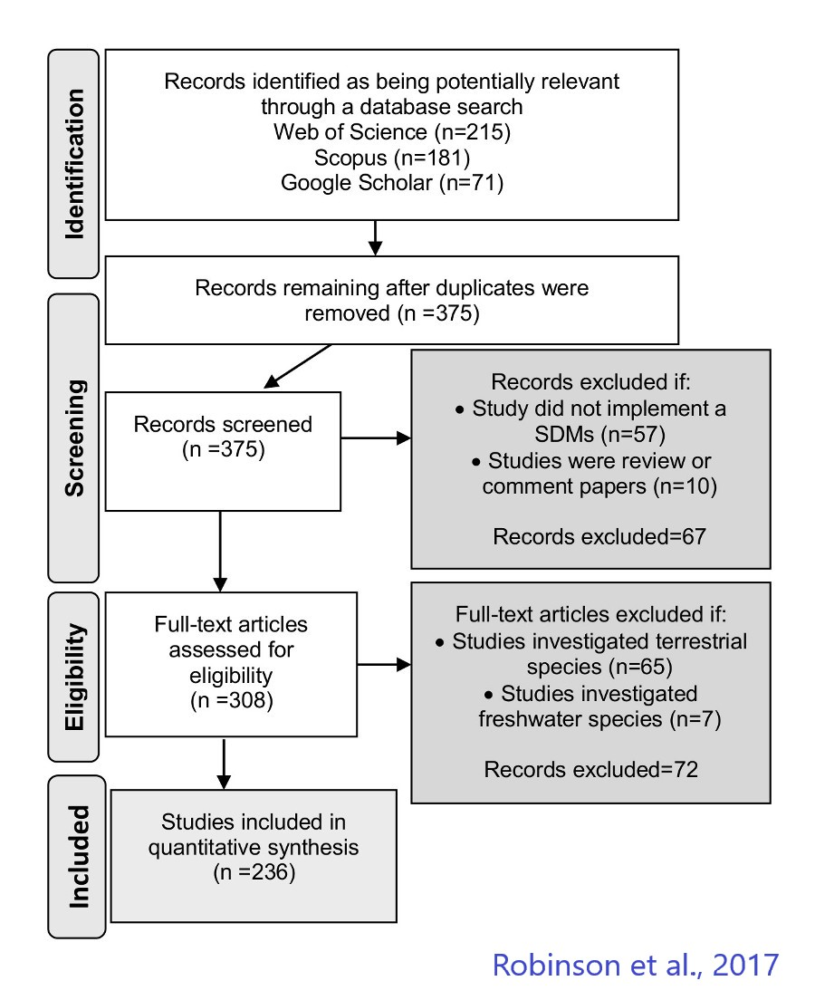
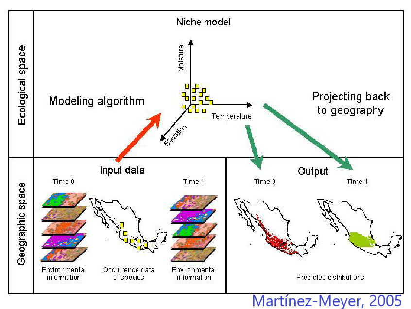
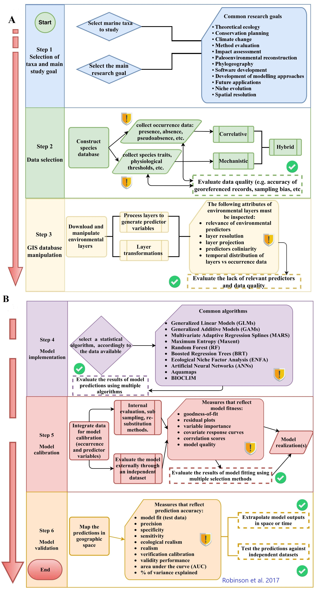
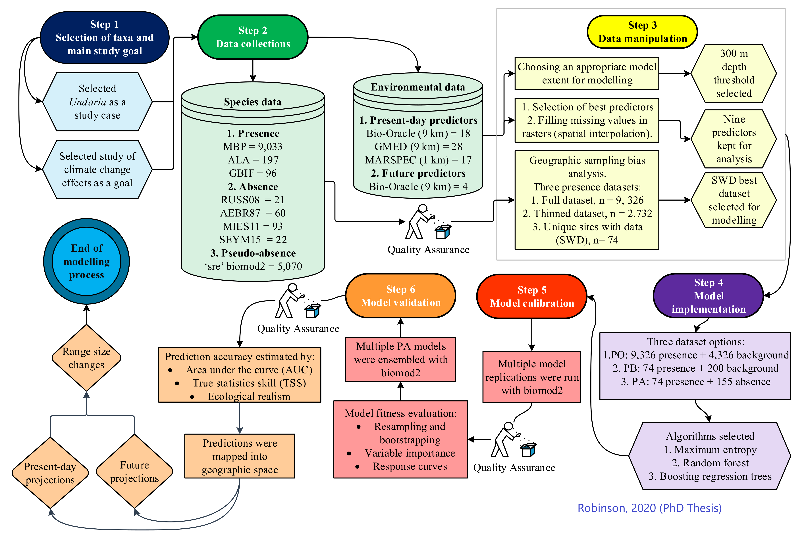
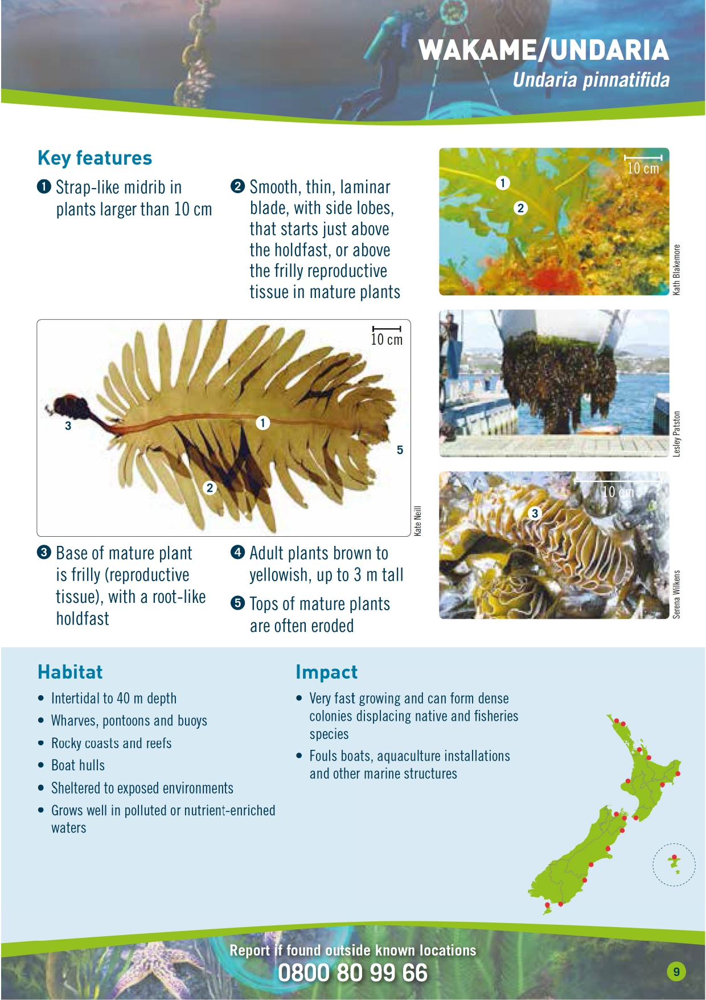

```{r setup, include=FALSE}
knitr::opts_chunk$set(echo = FALSE)
library(spocc) 
library(rgbif)
library(robis)
library(tidyverse)
library(proj4)
library(ggplot2)
library(spData)
library(sdmpredictors)
library(raster)
library(rasterVis)
library(biomod2)

polygon <-"POLYGON ((162.04834 -32.97180, 161.32324 -47.70976, 183.36182 -47.73932,181.95557 -32.84267, 162.04834 -32.97180))"

proj4 <- "+proj=tmerc +lat_0=0 +lon_0=173 +k=0.9996 +x_0=1600000 +y_0=10000000 +ellps=GRS80 +towgs84=0,0,0,0,0,0,0 +units=m +no_defs "

col.names <- c("scientificName", "decimalLongitude", 'decimalLatitude', "source")

NZmap <- map_data("world")%>%
  filter (region == 'New Zealand' & subregion %in% c("North Island" , "South Island"))

  
xlim <- c(165,179)
ylim <- c(-47,-34)
e <- extent(165, 179, -47, -34)


myTheme=theme_bw()+
  theme(axis.title.x = element_blank(),
        axis.text.x  = element_text(family="Times",color="Black",vjust=0.5,size=10),
        axis.title.y = element_blank(),
        axis.text.y  = element_text(family="Times",colour="Black",
                                    size=10,
                                    vjust=0.5,
                                    hjust=0),
        panel.grid.major = element_blank(), 
        panel.grid.minor =element_blank(),
        plot.title=element_blank(),
        legend.position = c(0.8,0.2),
        legend.title = element_text(size=10,family="Times"),
        legend.text=element_text(size = 10, family = 'Times'),
        legend.key.size = unit(0.6, 'cm'),
        legend.key.width = unit(0.6, 'cm'),
        legend.background = element_blank())

```
# My process to identify and source data
Systematic approach based on literature review (PRISMA) to generate deep understanding of scientific workflows. This allow me to identify where reliable data sources are and what are the main drawbacks of using the data for analysis and interpretations

for example: https://doi.org/10.3389/fmars.2017.0042 

```{r, out.width='65%', fig.align='center', fig.cap='...'}

```

# The example I would like to discuss is: A Species Distribution Model excerise

Before moving forward, I need to give you some background about what an Species Distribution model is and what are the main steps involved in the process

```{r, out.width='65%', fig.align='center', fig.cap='...'}

```
# The main steps of an SDMs exercise are the following:

```{r, out.width='60%', fig.align='center', fig.cap='...'}

```
# SDMs example following recommendations given in Robinson et al. 2017


```{r echo=FALSE, fig.align='center', fig.cap='...', message=FALSE, warning=FALSE, out.width='75%'}

```


# Step 1 - Selecting the taxa and study goal
```{r fig.align='center', fig.cap='...', message=FALSE, warning=FALSE, out.width='75%'}

```


# Step 2 - Compile environmental dataset 
For modelling the distribution of marine species, a great deal of datasets is readily available for download.These are raster layers of global coverage at a coarse resolution of 9 km and finer grain at 1 km. 

1. MARSPEC: http://www.marspec.org/
2. GMED: https://gmed.auckland.ac.nz/download.html
3. Bio-Oracle: https://bio-oracle.org/

```{r echo=TRUE, message=FALSE, warning=FALSE}
datasets <- list_datasets(terrestrial = FALSE, marine = TRUE)
layers <- list_layers(datasets)

env <- load_layers(layers
                   [layers$layer_code %in% 
                       c("BO_ph", "BO_dissox",
                         "BO_nitrate",
                         "BO_salinity",
                         "BO_sstmean",
                         "BO_bathymean") & 
                       layers$dataset_code == "Bio-ORACLE",],
                   datadir = "../data/bioOracle/")


env.nz <-stack(raster::crop(env, extent(e)))
plot(env.nz)

```

# Step 2 - Continues ... construct occurrence data set 

For marine species, occurrence data is available in several biodiversity databases. In the case of _Undaria_, data is available for download from three data sources. 

- Marine Biosecurity Porthole: https://marinebiosecurity.org.nz/search-for-species/
- Global Biodiversity Information Facility: https://www.gbif.org/occurrence/search?country=NZ&taxon_key=5422556
- Ocean Biodiversity Information System:  https://mapper.obis.org/?taxonid=145721&countryid=154

```{r echo=TRUE, message=FALSE, warning=FALSE}
{gbif <- occ (query = 'Undaria pinnatifida',
              from = 'gbif',
              gbifopts = list(publishingCountry="NZ"))
gbif <- occ2df(gbif)}

obis <- occurrence("Undaria pinnatifida", 
                   geometry = polygon)

mbph <- read.csv ("../data/Undaria_Porthole.csv", header = T)

lapply(list(gbif[1:3],obis[c(8,11,29)],mbph[c(12,6,7)]), head) 
```

```{r echo=TRUE, message=FALSE, warning=FALSE}
x_y <- mbph[,26:27]
lon_lat <- as.data.frame(proj4::project(x_y, proj4, inverse=T)) %>%
rename(c(longitude = x, latitude = y))

mbph <- cbind(mbph, lon_lat)
  
data.mbph <- mbph %>%
  mutate (source = "MBPH")%>%
  rename (c(scientificName = taxon_name, decimalLongitude = longitude, decimalLatitude = latitude))%>%
  dplyr::select (col.names)
```

```{r echo=TRUE, message=FALSE, warning=FALSE}
data.obis <- obis %>%
  mutate (source = "OBIS")%>%
  dplyr::select (col.names)

data.gbif <- gbif %>%
  mutate (scientificName = "Undaria pinnatifida", source = "GBIF")%>%
  rename (c(decimalLongitude = longitude,decimalLatitude = latitude))%>%
  dplyr::select(col.names)

Undaria.occ <- rbind(data.mbph, data.obis, data.gbif)%>%
  mutate(occ = 1)%>%
  drop_na()

ggplot()+
  geom_polygon(data = NZmap, aes(x = long, y= lat, group = group), alpha = 0.3) +
  geom_point(data= Undaria.occ, 
             mapping = aes(x = decimalLongitude,
                           y = decimalLatitude),
             colour = 'red')+
  coord_sf (xlim = xlim, ylim = ylim)+
  myTheme
```

# Step 3 - Data transformation and preparation for analysis

```{r echo=TRUE, message=FALSE, warning=FALSE}
myRespName1='Asian kelp' 
myResp1=(as.numeric(Undaria.occ[,"occ"]))
myRespXY1=Undaria.occ[2:3]


# Formating the data # 


biomod.data=BIOMOD_FormatingData(resp.var = myResp1,
                                  expl.var=env.nz,
                                  resp.xy=myRespXY1,
                                  resp.nam= 'Asian kelp',
                                  PA.nb.rep = 1,
                                  PA.strategy = 'sre',
                                  PA.sre.quant = 0.025,
                                  PA.nb.absences = 5000,
                                  na.rm = T)

plot(biomod.data)


biomod.data
```


